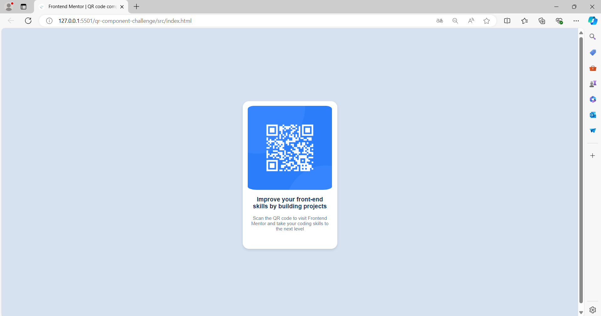

# Frontend Mentor - QR code component solution

This is a solution to the [QR code component challenge on Frontend Mentor](https://www.frontendmentor.io/challenges/qr-code-component-iux_sIO_H). Frontend Mentor challenges help you improve your coding skills by building realistic projects.

## Table of contents

- [Overview](#overview)
  - [Screenshot](#screenshot)
  - [Links](#links)
- [My process](#my-process)
  - [Built with](#built-with)
  - [What I learned](#what-i-learned)
  - [Continued development](#continued-development)

## Overview

### Screenshot



### Links

- Solution URL: [Add solution URL here](https://your-solution-url.com)
- Live Site URL: [Github Pages](https://testing-skills.github.io/qr-component-challenge/src/)

## My process

### Built with

- Semantic HTML5 markup
- Flexbox
- CSS Grid

### What I learned

I've recently started making this kind of pages by myself. At the beginning, I only wanted to make the page with simple design.
Almost finishing the challenge, I started thinking about the width and height of the qr. What I mean is to adapt the page according to the responsive design since there are different screen sizes.
The main problem I have is CSS since I am not get used to it. For example this part of my proyect:

```css
#qr {
  border-radius: 20px;
  background-color: white;
  width: 16%;
  min-width: auto;
  height: 50%;
  min-height: auto;
  aspect-ratio: 310/420;
  text-align: center;
  box-shadow: 0 4px 8px rgba(0, 0, 0, 0.1);
  padding: 5px;
  overflow: hidden;
}
```

### Continued development

I would be focus on CSS and JS. I would like to enhance my skills to make great pages with a incredible design and interactivity.
For me, design is the most difficult part in making pages.
